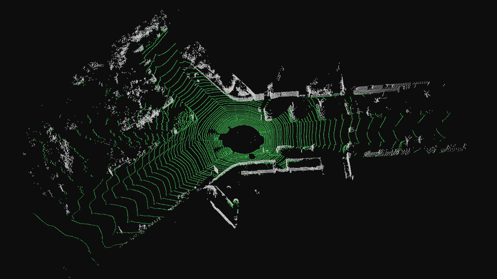
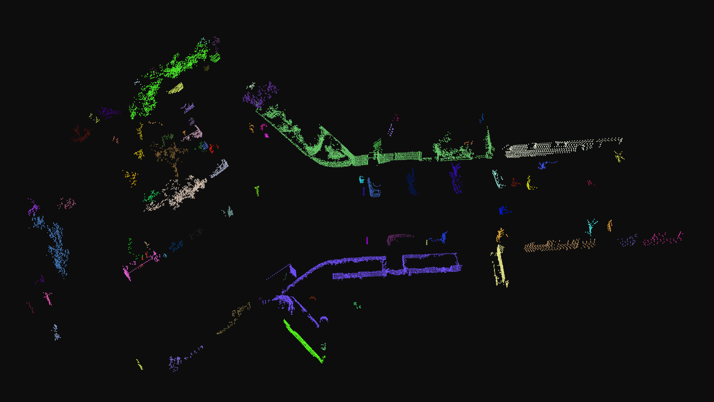

# lidar_mos

A learning project in LiDAR perception and modern C++, built with PCL. The aim is
as much to deepen my understanding of point-cloud processing (ground segmentation,
clustering, detection) and my modern C++ skills as it is to build a working tool.

The end goal is moving-object segmentation: separate moving things (cars, cyclists,
people) from the static scene and remove them. This repo is the object-detection
stage of that pipeline.

## What it does

A single-frame pipeline on KITTI scans:

```
load .bin -> crop -> voxel downsample -> ground removal -> clustering -> bounding boxes
```

Each detected object is shown in its own color with a 3D box in a live viewer.

Ground removal (ground in green, objects in gray):



Clustered objects, each in its own color:



## Build

Needs a C++20 compiler, CMake, and PCL (1.8 or newer).

```bash
mkdir build && cd build
cmake ..
make
```

## Run

```bash
./mos <scan.bin> [ground|clusters|boxes]
```

The second argument picks what to view (default `boxes`):
- `ground` - ground plane in green, objects in gray
- `clusters` - each object in its own color
- `boxes` - clusters with 3D bounding boxes

A scan is any KITTI velodyne `.bin`. Drag to rotate, scroll to zoom.

## Data

Uses the [KITTI Odometry](https://www.cvlibs.net/datasets/kitti/eval_odometry.php)
dataset: LiDAR scans recorded from a car driving through a city. The data is
grouped into "sequences", each a separate continuous drive, stored as a folder of
`velodyne/*.bin` scans. Sequences 00-10 also ship ground truth (the car's
trajectory and, via [SemanticKITTI](http://semantic-kitti.org/), per-point
labels), used later for the moving-object work.

The dataset is not included (large and separately licensed). Download it and point
`mos` at any `.bin`. Only the scans are needed for detection; the labels are for
the later segmentation stage.

## Status

Working: load, crop, voxel downsample, ground removal (horizontal-constrained
RANSAC), Euclidean clustering, axis-aligned bounding boxes.

## Limitations

This is a first version, correct in structure but not tuned for accuracy.

- **Ground removal** works on most frames (~2% leftover) but fails on cluttered
  scenes. The single RANSAC plane is height-blind, so it can lock onto a slab of
  object points about a meter above the road and leave the ground behind. A
  height-anchored or sector-based fit would fix it.
- **Clustering** groups every dense blob, including walls, vegetation, and small
  fragments, not just real objects. There is no size or shape filtering yet, so
  many boxed "detections" are not actually objects.
- **Sparse and distant objects** get few LiDAR returns, so they cluster poorly or
  fall below the minimum-size threshold and are missed.
- **Parameters** (crop range, voxel size, cluster tolerance, thresholds) are
  hand-set, not tuned, and may need adjusting per scene.

These are known and are the focus of the next iterations.

## Next steps

- Height-anchor the ground fit to fix the cluttered-frame failures.
- Filter clusters by size and shape so only real objects are detected.
- Oriented (PCA) bounding boxes for a tighter fit on angled objects.
- Moving vs static classification across frames, the moving-object-segmentation goal.
